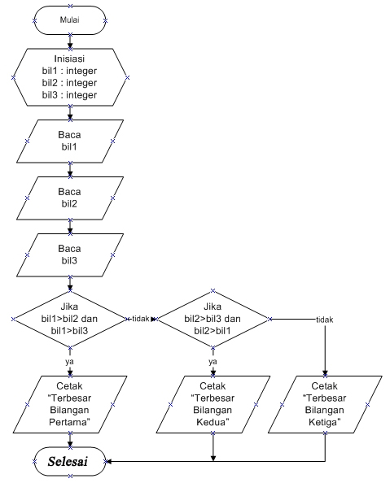
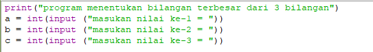
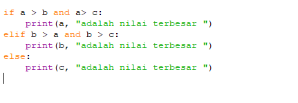
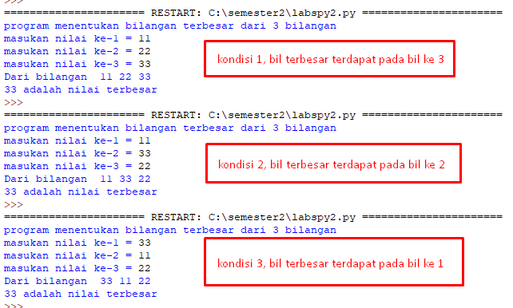

# Algoritma menentukan bilangan terbesar dari 3 bilangan <h2>

* Mulai
* Inisialisasi bil1, bil2, bil3
* Baca bil1
* Baca bil2
* Baca bil3
* Jika bil1 > bil2 dan bil1 > bil3 maka cetak bil1 terbesar
* Jika tidak, bil2 > bil1 dan bil2 > bil3 maka cetak bil2 terbesar
* Jika tidak, bil3 maka cetak terbesar

# Flowchart menentukan bilangan terbesar dari 3 bilangan <h3>

# hasil program dan eksekusi <h2>
* **Program setelah dibuat dari algoritma di atas**

* **_penjelasan program_**

* **Inisialisasi dan input**

* **Percabangan** 

* **Hasil dalam 3 konsidi bilangan**

